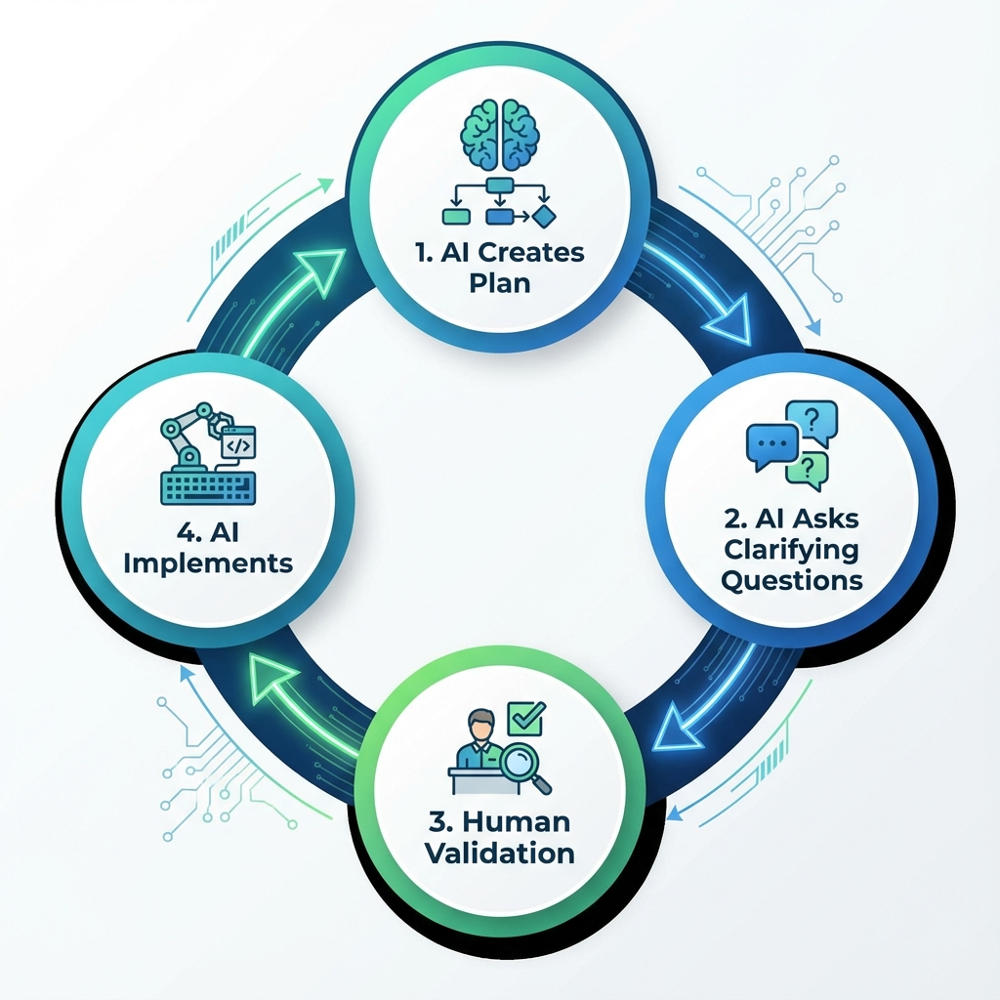

# 🚀 AIDLC for Antigravity

**AI-Driven Development Life Cycle (AIDLC)** is a transformative methodology that reimagines software engineering by positioning AI as a central collaborator and teammate.

This repository provides a **self-contained, agentic implementation** of AIDLC specifically for **Antigravity**, enabling you to adopt this next-generation workflow immediately.

---

## 🧠 The New Mental Model

Traditional development often treats AI as a mere assistant. AIDLC flips this model. In this workflow, the AI **initiates and directs** the work, while you provide critical oversight and context.



The workflow follows a continuous loop:
1.  **AI Creates a Plan**: The agent analyzes the task and proposes a detailed execution path.
2.  **AI Asks Clarifying Questions**: Instead of guessing, the agent actively seeks your input to resolve ambiguities.
3.  **Human Validation**: You review and approve the plan.
4.  **AI Implements**: The agent executes the work (design, code, tests) based on the validated context.

---

## 🔄 The Three-Phase Lifecycle

AIDLC structures development into three distinct phases, each building upon the context of the last:

### 🔵 Phase 1: Inception ("Mob Elaboration")
*Focus: Alignment & Planning*
-   **Goal**: Transform business intent into detailed requirements and plans.
-   **Process**: The agent and user collaborate to define **WHAT** to build.
-   **Key Steps**: Workspace Detection, Requirements Analysis, Workflow Planning.

### 🟢 Phase 2: Construction ("Mob Construction")
*Focus: Speed & Quality*
-   **Goal**: Deliver working software.
-   **Process**: The agent proposes architecture, designs, and code. You provide real-time feedback on technical decisions.
-   **Key Steps**: Detailed Design, Code Generation, Build & Test.

### 🟡 Phase 3: Operations
*Focus: Reliability*
-   **Goal**: Deploy and manage.
-   **Process**: The agent applies accumulated context to manage infrastructure and deployments.

---

## 💎 Key Benefits

-   **🚀 Velocity**: Accelerate development by having the agent handle the heavy lifting of generating artifacts, code, and tests. 
-   **💡 Innovation**: Free up your time from routine tasks to focus on creative problem-solving and high-value logic.
-   **✅ Quality**: Build exactly what is needed. Continuous clarification ensures the output aligns perfectly with your intent.
-   **📉 Reduced Cognitive Load**: The agent manages the complexity and state, allowing you to focus on critical decisions.

---

## 🛠️ Getting Started

### Prerequisites
-   **Antigravity Agent**: Ensure you have the Antigravity environment set up.

### Installation
1.  **Use this Template**:
    -   Click the **"Use this template"** button at the top of the GitHub repository to create a new repository with the AIDLC workflow pre-configured.
    -   *Alternatively*, you can clone this repository and copy the `.agent` directory to your existing project.
2.  **Clone Your New Repo**:
    ```bash
    git clone https://github.com/YOUR_USERNAME/YOUR_NEW_PROJECT.git
    cd YOUR_NEW_PROJECT
    ```
3.  **That's it!** The workflow is self-contained in `.agent/workflows/aidlc.md`.

### Usage
To start the workflow, simply use the slash command in your Antigravity chat:

```
/aidlc
```

---

## 📂 Artifacts & Documentation

AIDLC keeps your project organized. All generated artifacts are stored in `aidlc-docs/`:

-   `aidlc-docs/aidlc-state.md`: The current status of the workflow.
-   `aidlc-docs/audit.md`: A log of all major actions and user approvals.
-   `aidlc-docs/inception/`: Requirements, plans, and design specs.
-   `aidlc-docs/construction/`: Detailed designs and test reports.

---

## 📄 License

This project is licensed under the **MIT License**. See the [LICENSE](LICENSE) file for details.
